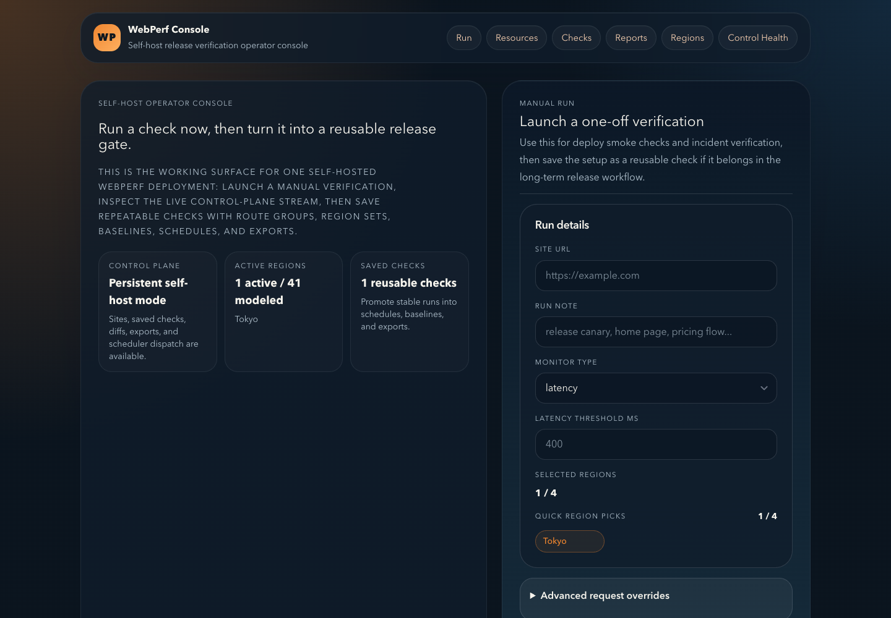
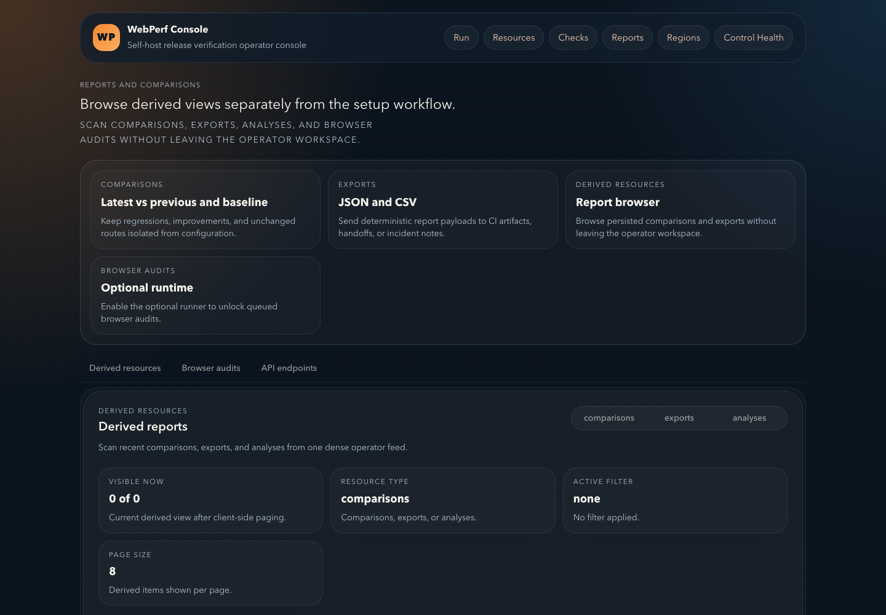

# WebPerf

Self-hosted release verification for teams that need to answer one practical
question: **did this deploy get worse?**

WebPerf runs repeatable network checks from the location where you deploy it,
keeps run history and baselines in SQLite, and produces deterministic
comparisons and exports. The default installation is a small,
single-organization stack with an operator console, API with embedded
scheduling, durable executor, and Rust probe. An
engine-neutral Browser Audit Protocol and Lighthouse reference runner are
available as an optional profile.

[Apache-2.0](LICENSE) · [User guides](docs/users/README.md) ·
[Public API](docs/architecture/public-api-surface.md) · [Security](SECURITY.md)

## Screenshots





## Docker quick start

Use a tagged bundle from
[GitHub Releases](https://github.com/Webperf-and-Guide/webperf-selfhosted/releases).
The bundle pins every runtime image by OCI digest; a source checkout and Bun
are not required.

```sh
# After downloading webperf-selfhosted-v0.x.y.tar.gz and SHA256SUMS:
sha256sum --check SHA256SUMS
tar -xzf webperf-selfhosted-v*.tar.gz
cd webperf-selfhosted-v*/
sha256sum --check SHA256SUMS

cp .env.example .env
chmod 600 .env
```

Generate four independent secrets with `openssl rand -base64 32` and replace
the placeholder values for `SELFHOST_ADMIN_TOKEN`,
`SELFHOST_INTERNAL_SECRET`, `PROBE_SHARED_SECRET`, and
`BROWSER_AUDIT_SHARED_SECRET` in `.env`. Then start the default stack:

```sh
docker compose --env-file .env -f compose.yml up -d
docker compose --env-file .env -f compose.yml ps
curl --fail http://127.0.0.1:5173/
```

Open `http://127.0.0.1:5173`. Only the console is published, and it binds to
loopback. The API, executor, probe, and optional browser runner stay
on internal Compose networks.

Read the full [installation guide](docs/users/install.md) before using a
non-local hostname or upgrading an existing database.

## Core features

- One-off Fast Checks for deploy smoke tests and incident verification.
- Reusable Sites, Route Groups, and Checks with request overrides,
  latency or uptime policy, webhook alerts, and interval schedules.
- Durable SQLite-backed execution leases, bounded retry, graceful shutdown,
  and restart recovery instead of API-process fire-and-forget work.
- Latest-vs-previous and pinned-baseline comparisons, deterministic Analysis,
  and JSON/CSV exports.
- One explicit runtime location recorded as provenance on every Fast Check and
  Browser Audit. Deploy one installation per location when you operate several.
- Encrypted persisted payloads, secret redaction, HMAC-authenticated runtimes,
  and connection-layer SSRF protection.
- Authenticated local artifact storage with size limits, SHA-256 indexes,
  retention reconciliation, and streaming downloads.

Start with the [operator guide index](docs/users/README.md), then follow
[Regions](docs/users/regions.md), [Checks](docs/users/checks.md), and
[Scheduling](docs/users/scheduling.md) for the normal setup flow.

## Optional Browser Audit

Browser Audit is off by default. Enable the `browser-audit` profile to add the
Lighthouse reference runner for navigation, snapshot, and timespan flows:

```sh
# In .env:
# SELFHOST_BROWSER_AUDIT_BASE_URL=http://browser-audit-lighthouse:8080

docker compose --env-file .env --profile browser-audit -f compose.yml up -d
```

Ubuntu 24.04 and other AppArmor 4 hosts must first load the bundled
`browser-audit.apparmor` profile and add `-f compose.apparmor.yml` to that
command. The [Browser Audits guide](docs/users/browser-audits.md) has the
persistent host setup.

The runner has no public host port, keeps Chrome sandboxing enabled, uses 1 GiB
of shared memory, and accepts one audit at a time. Compose drops all Linux
capabilities and restores only `SYS_CHROOT`, which Chromium needs to enter its
sandbox root; `SYS_ADMIN` remains absent. Audits are queued through the durable
executor; result contracts remain engine-neutral so another compatible runner
can be added without changing public report shapes.

See [Browser Audits](docs/users/browser-audits.md) and
[artifact storage](docs/users/artifacts.md).

## Security warning

> WebPerf self-hosted is a trusted, single-organization deployment. Do not
> expose the console directly to the public internet. For remote access, keep
> the console on loopback and put it behind a TLS reverse proxy plus an
> additional access-control layer. Never publish the API, probe, executor,
> scheduler, Browser Audit runner, or `debug` profile.

Only `GET /health`, `GET /v1/capabilities`, and
`GET /openapi/public.json` are intentionally unauthenticated at the API
boundary. All data and execution routes require the administrator credential;
internal dispatch and execution routes require the internal credential.

Read [Security](docs/users/security.md),
[reverse proxy guidance](docs/users/reverse-proxy.md), and
[self-host authentication](docs/security/auth-and-secrets.md) before external
access.

## Self-hosted and WebPerf Cloud

| | `webperf-selfhosted` | `webperf.and.guide` |
| --- | --- | --- |
| Operations | You install, secure, back up, and upgrade it | Managed service operations |
| Organization model | One trusted organization | Hosted teams, workspaces, and permissions |
| Runners | Your probes and optional browser runner | Managed orchestration and runner fleet |
| Product logic | Public contracts, deterministic reports, self-host workflow | Billing, quotas, collaboration, and managed automation |
| Data | Your SQLite database and artifact volume | Hosted storage and retention |

This repository is the public source of truth for self-host contracts, schemas,
domain models, report logic, console/API behavior, deployment examples, and
runtime images. It intentionally excludes billing, multi-tenancy, managed
fleet orchestration, private provider credentials, and AI analyst product
features. It also publishes the provider-neutral
[Regional Runtime Protocol](docs/architecture/regional-runtime-handoff.md) and
three-container deployment profile used by managed orchestrators. See
[Cloud vs self-hosted](docs/users/cloud-vs-self-hosted.md).

## Upgrade and backup

Back up both the SQLite database and artifact directory before every upgrade.
Keep the matching `.env` secrets with the recovery record: encrypted payloads
cannot be restored without the internal secret that encrypted them.

- [Backup and restore](docs/users/backup-restore.md)
- [Upgrade a digest-pinned release](docs/users/upgrade.md)
- [Troubleshooting](docs/users/troubleshooting.md)
- [Release images, SBOMs, and provenance](docs/quickstart/runtime-images.md)

## Contributor setup

Source development requires Bun `1.3.13`, Rust `1.86`, and the local toolchain
described in [Contributor development](docs/contributors/development.md).

```sh
bun install --frozen-lockfile
bun run dev

bun run check
bun test
cargo fmt --all --check --manifest-path apps/probe-rs/Cargo.toml
cargo clippy --workspace --all-targets --manifest-path apps/probe-rs/Cargo.toml -- -D warnings
cargo test --workspace --manifest-path apps/probe-rs/Cargo.toml
```

User-visible changes require a Sampo changeset. Read
[CONTRIBUTING.md](CONTRIBUTING.md) and the
[release guide](docs/contributors/releases.md) before opening a PR.

## Reference

- [Canonical public API and compatibility policy](docs/architecture/public-api-surface.md)
- [Durable execution model](docs/architecture/execution-model.md)
- [Engine-neutral Browser Audit Protocol](docs/architecture/browser-audit-protocol.md)
- [Feature scope](docs/self-hosting/feature-scope.md)
- [Changelog](CHANGELOG.md)
